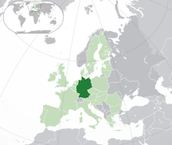

```{r setup, include=FALSE}
library(knitr)
knitr::opts_chunk$set(echo = FALSE)
```

### Introduction

Germany is a country in Central and Western Europe, lying between the Baltic and North Seas to the north, and the Alps to the south. It borders Denmark to the north, Poland and the Czech Republic to the east, Austria and Switzerland to the south, France to the southwest, and Luxembourg, Belgium and the Netherlands to the west. Known for its rich cultural history, Germany has been continuously the home of influential and successful artists, philosophers, musicians, film people, sportspeople, entrepreneurs, scientists, engineers, and inventors. Germany has a large number of World Heritage sites and is among the top tourism destinations in the world.  


Text and image taken from [Wikipedia](https://en.wikipedia.org/wiki/Germany).

### Data
The following life expectancy data is taken from the Human Mortality Database. The [Human Mortality Database (HMD)](http://www.mortality.org) was created to provide detailed mortality and population data to researchers, students, journalists, policy analysts, and others interested in the history of human longevity.

#### Table
```{r, echo=FALSE}
dd <- read.table(file="~/Documents/CSDE 502/Week 9/GermanyLifeExpectancy.dat", header=TRUE)
## table
kable(dd, caption="German Life Expectancy at Birth")
```

#### Plot
```{r, echo=FALSE}
### plot total
plot(dd$Year, dd$Total, ylim=c(60,85), xlim=c(1991,2019), type="l", las=1,
     xlab="Year", ylab="Age (in Years)",main="German Life Expectancy at Birth")

### grid lines
segments(x0=seq(1995, 2015, 5), x1=seq(1995, 2015, 5), y0=50, y1=90, lty="dotted")
segments(y0=seq(65, 80, 5), y1=seq(65, 80, 5), x0=1980, x1=2020, lty="dotted")

### plot females
lines(dd$Year, dd$Female, col="red")

### plot males
lines(dd$Year, dd$Male, col="blue")

## add legend
legend(2013, 68, legend=c("Total","Male","Female"), lty=1, col=c("black","blue","red"))
```

Between `r dd$Year[1]` and `r dd$Year[nrow(dd)]`, the total life expectancy in Germany increased from `r dd$Total[1]` years to `r dd$Total[nrow(dd)]` years.

#### Basic Regression Output
```{r, echo=FALSE}
fit <- lm(Total ~ Year, data=dd)
test <- summary(fit)
kable(test$coefficients, caption="Regression Table (y = age in years, x = year)")
```

Total German life expectancy increased at a rate of approximately `r test$coefficients[2]` years per year, from 1990 to 2017. This rate of change is statistically significant. 

